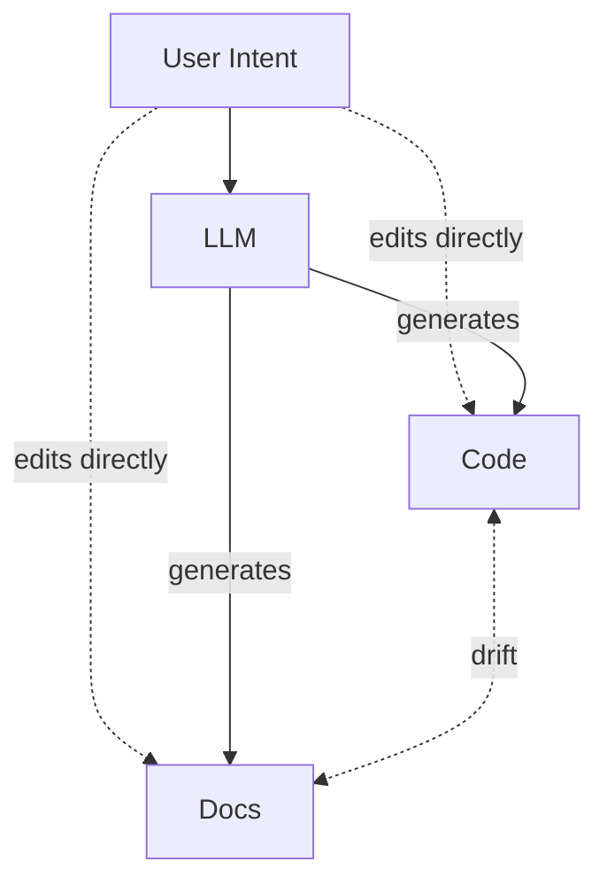
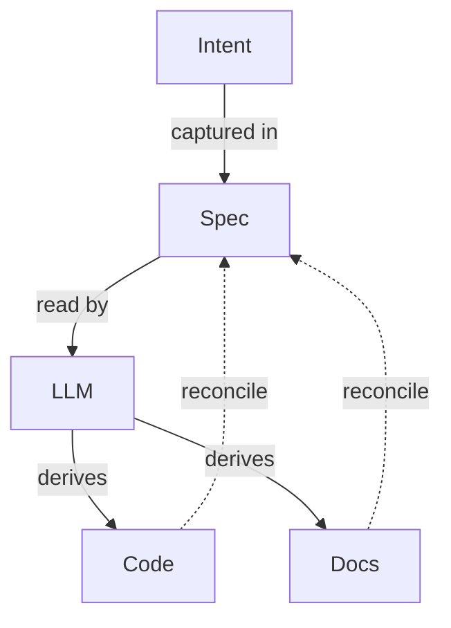

# NotarAI


A structured spec format and reconciliation engine that keeps intent, code, and documentation in sync using LLMs.

## The Problem

Before LLMs, code was the single source of truth. Documentation drifted, but it was clear which artifact was authoritative. Now, LLMs generate both code and documentation from natural language prompts, and either artifact can be the one that's "right." Intent lives in chat transcripts that disappear. Code, docs, and intent form a three-body problem where all three can diverge independently.



## The Solution

NotarAI introduces a **spec file** -- a structured YAML document governed by a JSON Schema -- that captures user intent as the canonical source of truth. An LLM acts as the reconciliation engine, detecting drift between the spec and its governed artifacts and proposing updates for human review.



The spec is version-controlled, diffable, and composable. It serves the same role for LLM-assisted development that a contract serves in an API: a shared agreement about what should exist and why.

## Spec Format

Specs are YAML files validated against a JSON Schema. The format uses progressive disclosure: a small set of required fields for minimum viability, with optional fields for precision as needed.

**Required fields:**

- `schema_version` -- pins the JSON Schema version
- `intent` -- natural language description of what the system should do
- `behaviors` -- structured Given/Then entries describing expected behavior
- `artifacts` -- glob patterns mapping the spec to the files it governs

**Optional fields:**

- `constraints` -- rules the system must follow
- `invariants` -- conditions that must never be violated
- `decisions` -- architectural decision log with date, choice, and rationale
- `open_questions` -- unresolved design questions
- `dependencies` -- references to other specs this one interacts with
- `sync_policy` -- configurable strategy for when and how reconciliation runs
- `notes` -- freeform hints for the LLM about implicit relationships

## How Reconciliation Works

The reconciliation engine detects three scenarios:

1. **Human edits code.** The engine detects that code has drifted from the spec and proposes spec and doc updates.

2. **Human edits spec.** The engine propagates the spec change to code and documentation.

3. **Conflict.** Code says one thing, the spec says another. The engine surfaces the disagreement and the human decides which is correct.

The system is always propose-and-approve, never auto-sync. Both humans and LLMs can edit everything; the spec is the tiebreaker.

## Coverage Model

Every file in the repo falls into one of three tiers:

- **Tier 1 (Full Spec)** -- Business logic, APIs, user-facing features. Full behavioral specification.
- **Tier 2 (Registered)** -- Utilities, config, sidecars. Intent and artifact mapping only, no behaviors required.
- **Tier 3 (Excluded)** -- Generated code, vendor deps, editor configs. Explicitly out of scope.

Files not covered by any tier are flagged as "unspecced" -- a lint warning, not a blocker.

## Getting Started

Spec files live in a `.notarai/` directory at the root of your repository:

```
project/
  .notarai/
    system.spec.yaml
    auth.spec.yaml
    billing.spec.yaml
    _shared/
      security.spec.yaml
  src/
  docs/
```

The top-level `system.spec.yaml` serves as the manifest, referencing subsystem specs via `$ref` and declaring exclusion patterns for Tier 3 files. Cross-cutting concerns (security, logging) are defined once in shared specs and applied across all subsystems.

## CLI Tool

The `notarai` CLI validates spec files against the JSON Schema and integrates with Claude Code via hooks.

### Installation

> [!NOTE]  
> This tool is in early development and still needs to be pressure tested with larger repos.

```sh
# In the future:
# npm install -g notarai

# Right now:
git clone https://github.com/davidroeca/NotarAI
cd NotarAI
npm ci
npm run build
npm link

# The above installs notarai globally - you can now run `npx notarai` or `notarai`

# To uninstall
npm uninstall -g notarai
```

### Setup

Run `notarai init` in your project root. This does two things:

1. Adds a PostToolUse hook to `.claude/settings.json` so spec files are automatically validated when Claude Code writes or edits them.
2. Copies the `/notarai-reconcile` slash command to `.claude/commands/` for drift detection.

```sh
notarai init
```

Running `init` again is safe -- it detects existing configuration and skips.

### Usage

```sh
# Validate all spec files in .notarai/
notarai validate

# Validate a specific file
notarai validate .notarai/auth.spec.yaml

# Validate a directory
notarai validate .notarai/subsystems/
```

Output is `PASS <file>` or `FAIL <file>` with an indented error list. Exit code is 0 if all files pass, 1 if any fail.

### Claude Code Integration

After running `notarai init`, spec files are validated automatically whenever Claude Code writes or edits a file in `.notarai/`. Invalid specs block the tool use with errors on stderr. Non-spec files are ignored silently.

Use the `/notarai-reconcile` slash command to detect drift between specs and code.

## Status

This project is in early development. The spec schema (`notarai.spec.json`) and CLI validator are implemented. Future goals include:

- Supporting other models and agentic ecosystems beyond Claude Code
- Minimizing token usage in spec-aware workflows
- Better project bootstrapping for existing codebases
- Broader reconciliation techniques that don't balloon the context

## License

Apache License 2.0. See [LICENSE](LICENSE) for details.
