# NotarAI — Design Diagrams

All diagrams from the design process, updated to reflect the NotarAI name and `.notarai/` directory convention.

---

## 1. The Problem: Pre-LLM vs Current LLM Era

### 1a. Pre-LLM: Code Is the Spec

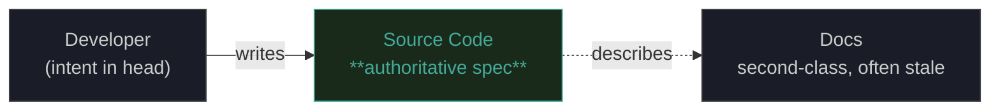

### 1b. Current LLM Era: The Three-Body Problem

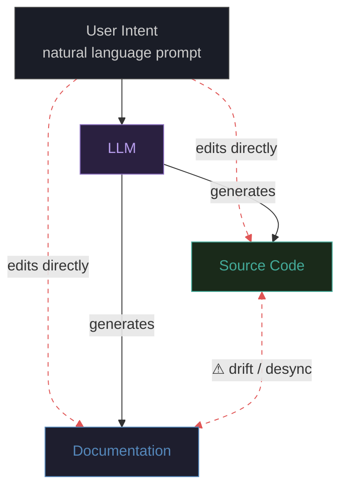

---

## 2. NotarAI: Spec State File as Single Source of Truth

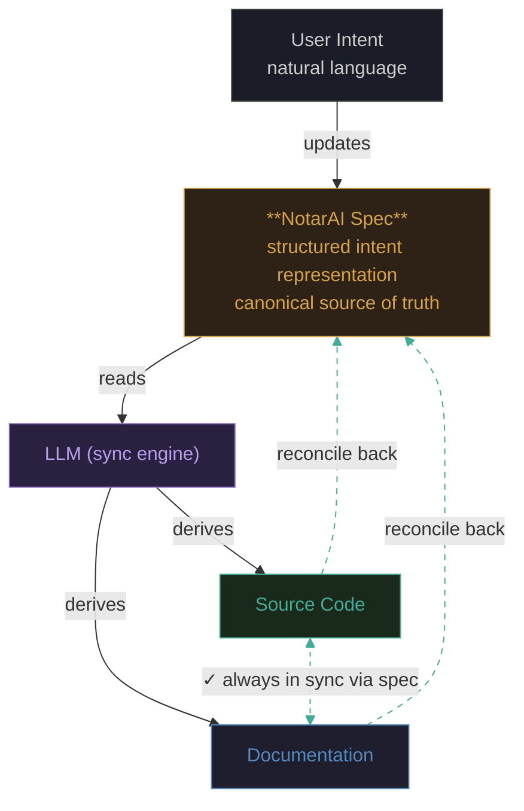

---

## 3. Spec File Anatomy

### 3a. Required Core

```yaml
# .notarai/auth.spec.yaml
schema_version: "0.3"

intent: |
  Users can sign up, log in, and
  reset passwords. Sessions expire
  after 30 min of inactivity.

behaviors:
  - name: "signup"
    given: "valid email + password"
    then: "account created, welcome email sent"
  - name: "session_timeout"
    given: "30 min inactivity"
    then: "session invalidated"

artifacts:
  code:
    - path: "src/auth/**"
  docs:
    - path: "docs/auth.md"
```

### 3b. Optional Extensions

```yaml
# Power users add precision as needed

constraints:
  - "passwords >= 12 chars"
  - "rate limit: 5 login attempts / min"

invariants:
  - "no plaintext passwords in DB"
  - "all endpoints require HTTPS"

decisions:
  - date: "2025-03-12"
    choice: "JWT over session cookies"
    rationale: "stateless scaling"

open_questions:
  - "Should we support OAuth2 providers?"
  - "MFA timeline?"

sync_policy:
  on_code_change: "propose_spec_update"
  on_spec_change: "update_code_and_docs"
```

> **Design note:** The `behaviors` field uses Given/Then language (BDD-adjacent) but stays in natural language — not formal Gherkin. Structured enough to diff and validate, informal enough that non-engineers can author it.

---

## 4. Reconciliation Lifecycle

### 4a. Scenario A: Human Edits Code

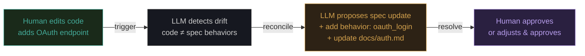

### 4b. Scenario B: Human Edits Spec

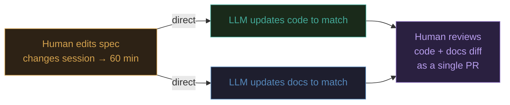

### 4c. Scenario C: Conflict Detected

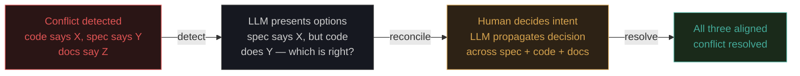

---

## 5. Sync Timing Strategies

**A. Spec-First ⚠ RISKY**


**B. Post-Push Reconciliation ✓ RECOMMENDED**

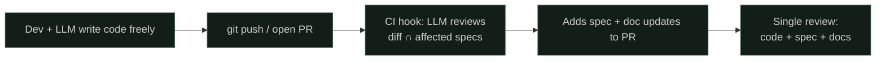

**C. Ambient Awareness — BALANCED**

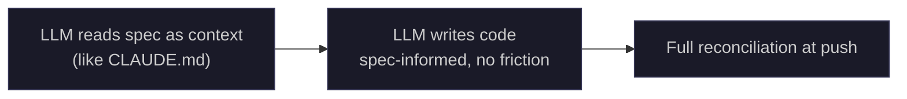

> **Recommendation:** Start with **B** (post-push) as the default — lowest friction, easiest to adopt. Design the spec format to support **C** (ambient awareness) as the long-term target. The `sync_policy` field lets teams opt into different strategies per spec.

---

## 6. Post-Push Reconciliation in Practice (Git Integration)

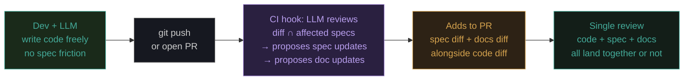

> The `artifacts` field in the spec tells the CI hook which specs are affected by which file paths — so it only reconciles what changed.

---

## 7. Spec Composition — The Import Model

### 7a. Directory Structure

```
project/
├── .notarai/
│   ├── system.spec.yaml          # top-level system spec
│   ├── auth.spec.yaml            # auth service (Tier 1)
│   ├── billing.spec.yaml         # billing service (Tier 1)
│   ├── api.spec.yaml             # API layer (Tier 1)
│   ├── utils.spec.yaml           # shared utilities (Tier 2)
│   ├── redis-cache.spec.yaml     # sidecar process (Tier 2)
│   └── _shared/
│       ├── security.spec.yaml    # cross-cutting
│       └── logging.spec.yaml     # cross-cutting
├── src/
│   ├── auth/
│   ├── billing/
│   └── api/
└── docs/
```

### 7b. Composition Relationships

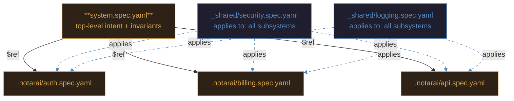

> When the LLM checks `auth.spec.yaml`, it also loads `security.spec.yaml` and validates that auth code satisfies **both** specs' invariants. Cross-cutting concerns are defined once and enforced everywhere.

---

## 8. Coverage Model — Three Tiers

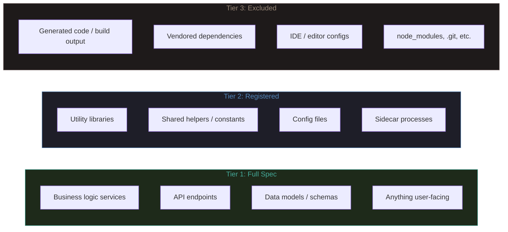

**Coverage equation:** `Tier 1 + Tier 2 + Tier 3 = entire repo`

Anything not covered = **unspecced** (a lint warning, not a block).

### Coverage Resolution (Zero Context Cost)

```
# At reconciliation time, the LLM:

1. Collects all artifact globs from every referenced spec (recursive)
   → covered

2. Collects all exclude patterns from system.spec.yaml
   → excluded

3. Lists all files in repo
   → git ls-files

4. Computes the gap
   → unspecced = all_files - covered - excluded

5. If unspecced is non-empty:
   → "These files aren't governed by any spec:
      - src/notifications/email.ts
      - src/notifications/sms.ts
      Assign to a spec or exclude?"

# Cost: ONE shell command + set math
# No file contents loaded — zero context window impact
```

---

## 9. Bootstrap Flow for Existing Codebases

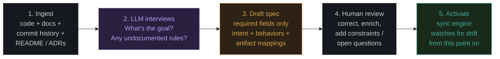

> Bootstrap starts minimal and accrues precision over time — the spec is a living document.

